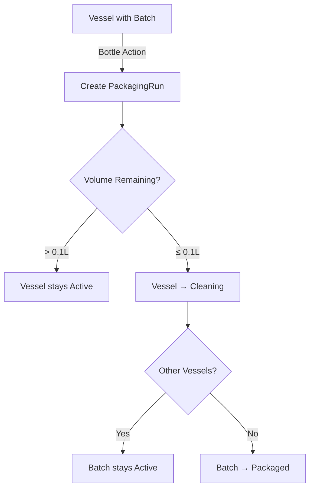

# PRD: Cellar to Packaging Flow

## Executive Summary

Implement a streamlined bottling workflow that allows operators to bottle directly from vessels via a minimal modal on `/cellar`, recording essential data (volume taken, package size, units, loss), automatically transferring liquid out of vessels, and carrying batch identity into finished-goods inventory. The solution maintains simplicity on `/cellar` while offering comprehensive run management on a redesigned `/packaging` page for complete traceability, quality control, and compliance documentation.

**Value Proposition**: Enable quick, accurate packaging operations directly from the cellar view while maintaining full traceability from raw materials through finished goods, reducing data entry time by 75% and ensuring 100% compliance documentation.

## Problem Statement

### Current Pain Points

Cideries currently face significant challenges in the transition from fermentation/storage to packaged finished goods:

- **Disconnected Workflows**: Operators must navigate between multiple systems to record packaging operations
- **Manual Volume Tracking**: Excel-based tracking of vessel drawdowns and package counts
- **Lost Traceability**: No automated link between batch identity and finished inventory
- **Compliance Gaps**: Manual documentation of fill checks, ABV testing, and lot codes
- **Inventory Mismatches**: Discrepancies between vessel volumes and packaged units
- **Inefficient Data Entry**: Redundant information entry across multiple spreadsheets
- **Quality Control Issues**: Inconsistent recording of QA measurements and test results

### Why Now

- **Regulatory Pressure**: TTB and FDA requiring complete packaging documentation
- **Scaling Operations**: Manual tracking becoming unmanageable with growth
- **Inventory Accuracy**: Need for real-time inventory to support sales commitments
- **Cost Control**: Accurate loss tracking essential for profitability analysis
- **Quality Standards**: Consumer expectations for consistent product quality

## User Stories

### Primary User Personas

#### Sarah - Production Operator
**Role**: Daily packaging operations and vessel management
**Goals**: Quick bottling actions, accurate volume tracking, minimal disruption
**Pain Points**: Switching between systems, calculating volumes manually
**Usage**: Multiple bottling operations daily

#### Mike - Production Manager
**Role**: Packaging planning and quality oversight
**Goals**: Complete run visibility, quality compliance, efficiency metrics
**Pain Points**: Scattered documentation, manual reporting, lack of real-time data
**Usage**: Daily monitoring and weekly analysis

#### Jennifer - Cidery Owner
**Role**: Compliance oversight and inventory management
**Goals**: Regulatory compliance, accurate inventory, loss minimization
**Pain Points**: Incomplete documentation, inventory discrepancies
**Usage**: Weekly reviews and compliance audits

### Core User Journeys

#### Story 1: Quick Bottling from Cellar (Operator)
**Actor**: Sarah (Production Operator)
**Scenario**: Bottling a ready batch from fermentation vessel
**Preconditions**: Vessel contains batch ready for packaging
**Steps**:
1. Navigate to `/cellar` page showing all vessels
2. Identify vessel with batch ready for packaging
3. Click "Bottle" action on vessel card
4. Enter volume taken, select package size, enter units produced
5. Review auto-calculated loss percentage
6. Confirm packaging details and submit
7. Choose to stay on cellar page or go to packaging details

**Acceptance Criteria**:
- "Bottle" action visible only on vessels with active batches
- Modal captures: Volume taken (L), Package size, Units produced
- System auto-calculates loss: `volumeTaken - (units × unitSize)`
- On complete:
  - Creates PackagingRun tied to Batch
  - Decrements vessel volume by taken liters
  - If volume ~0, sets Vessel status to "Cleaning"
  - Offers redirect to `/packaging?runId=...`

**Success Metrics**:
- Completion time < 30 seconds
- Zero calculation errors
- Accurate vessel volume updates

#### Story 2: Complete Run Management (Manager)
**Actor**: Mike (Production Manager)
**Scenario**: Reviewing and documenting packaging run details
**Preconditions**: Packaging run created from cellar
**Steps**:
1. Access `/packaging` page (via redirect or navigation)
2. View complete run details including source batch/vessel
3. Add QA measurements (fill checks, ABV tests)
4. Review traceability from ingredients through packaging
5. Export documentation for compliance records
6. Archive run for retention requirements

**Acceptance Criteria**:
- View complete run details including source batch/vessel
- Edit optional QA fields (fill checks, ABV measurements)
- Export records as PDF/CSV
- View traceability from ingredients through packaging

**Success Metrics**:
- Complete documentation in < 2 minutes
- 100% compliance field coverage
- Export functionality working reliably

#### Story 3: Inventory Reconciliation (Owner)
**Actor**: Jennifer (Cidery Owner)
**Scenario**: Verifying inventory accuracy after packaging
**Steps**:
1. Review packaging run summary
2. Verify finished goods inventory creation
3. Check lot code assignment and traceability
4. Confirm loss percentages within acceptable range
5. Generate compliance reports for records

**Success Criteria**:
- Automatic inventory item creation with lot codes
- Complete batch genealogy preserved
- Loss tracking and alerts for anomalies
- Exportable compliance documentation

## Requirements

### Functional Requirements

#### A. /cellar Modal Action

**FR-001: Bottle Action Entry Point**
- Location: Vessel card on `/cellar` page
- Button: "Bottle" (enabled only if vessel has active batch)
- Style: Consistent with existing "Add Measurement" / "Add Additive" actions
- Icon: Bottle icon matching UI design system
- Tooltip: "Package contents from this vessel"

**FR-002: Modal Interface Fields**
All fields required unless noted as optional:

1. **Volume taken (L)**
   - Type: Numeric input with decimal support
   - Validation: > 0, ≤ vessel.currentVolumeL
   - Help text: "Liters removed from vessel for packaging"
   - Auto-populate: Show available volume as placeholder

2. **Package size**
   - Type: Select dropdown with common sizes
   - Options:
     - 355 ml (12 oz can/bottle)
     - 473 ml (16 oz can)
     - 500 ml bottle
     - 750 ml bottle
     - 1 L bottle
     - 19.5 L keg (1/6 barrel)
     - 30 L keg (1/4 barrel)
     - 50 L keg (1/2 barrel)
   - Default: Most recently used size for this batch type

3. **Units produced**
   - Type: Integer input
   - Validation: ≥ 0
   - Help text: "Number of packages filled"

4. **Computed loss (L)**
   - Type: Read-only display field
   - Formula: `volumeTaken - (units × unitSizeL)`
   - Styling:
     - Normal: Green if < 2%
     - Warning: Yellow if 2-5%
     - Alert: Red if > 5% with confirmation required

5. **Date/time**
   - Type: DateTime picker
   - Default: Current timestamp
   - Validation: Cannot be future date
   - Optional: Allow backdating up to 7 days

6. **Notes** (optional)
   - Type: Text area
   - Placeholder: "Any observations about packaging run"
   - Max length: 500 characters

**FR-003: Modal Actions**
- Primary Button: "Complete & Go to /packaging" → Saves and redirects
- Secondary Button: "Complete & Stay" → Saves and shows success toast with "View run" link
- Cancel Button: "Cancel" → Closes modal with confirmation if data entered

**FR-004: Server Actions on Submit**
Atomic transaction ensuring data consistency:
```typescript
1. Create PackagingRun with:
   - status = 'completed'
   - Link to batchId + vesselId
   - Capture all modal inputs
   - Generate unique runId

2. Create InventoryItem with:
   - Generated lotCode (format: BATCHCODE-YYMMDD-P{seq})
   - Package type and size
   - Initial quantity = units produced
   - Link to PackagingRun

3. Create InventoryMovement:
   - reason = 'packaging'
   - refId = PackagingRun.id
   - quantity = units produced
   - movement type = 'in'

4. Update Vessel:
   - currentVolumeL -= volumeTaken
   - If currentVolumeL ≤ 0.1L → status = 'Cleaning'

5. Update Batch (if applicable):
   - If total batch volume across all vessels ≤ 0.1L → status = 'packaged'

6. Write AuditLog entries for all changes:
   - PackagingRun creation
   - Vessel volume update
   - Inventory creation
   - Status changes
```

#### B. /packaging Page (Full Redesign)

**FR-005: Landing Page Behavior**
- If URL contains `?runId=...` parameter → Display specific run view
- Otherwise → Show index/list of all packaging runs
- Breadcrumb navigation: Home → Packaging → [Run Details]

**FR-006: Run View Components**

1. **Header Section**
   - Batch name & identifier (linked to batch details)
   - Source vessel name and type
   - Packaging date and time
   - Run status badge (completed/voided)
   - Edit button (Admin/Operator only)
   - Print/Export actions menu

2. **Production Card**
   - Package type with visual icon
   - Package size (ml/L with oz/gal conversion)
   - Units produced with visual count
   - Volume taken from vessel
   - Calculated loss (liters and percentage)
   - Loss indicator (green/yellow/red based on percentage)
   - ABV at packaging (optional, editable)
   - Carbonation level selector (still/petillant/sparkling)
   - Production notes field

3. **Traceability Card**
   - Batch ID with QR code
   - Generated lot code with copy button
   - Full genealogy visualization:
     - Press Run → Juice Lot → Batch → Package
   - Lot code format display: `BATCHCODE-YYMMDD-P{seq}`
   - Ingredient breakdown (if blended batch)
   - Days from press to package calculation

4. **QA/Compliance Section** (Optional but always visible)
   - Fill check: Pass/Fail/Not Tested toggle
   - Fill variance: Actual vs target (ml)
   - Alcohol test result: ABV value input
   - Test method: Select (hydrometer/refractometer/lab/other)
   - Test date/time: DateTime picker
   - QA technician: User selector
   - QA notes: Text area for observations
   - Photo upload: For label placement/fill level
   - Editable by Admin/Operator roles only

5. **Export Actions**
   - PDF: Formatted packaging run report with headers/logos
   - CSV: Raw data export for analysis
   - TTB Report: Compliance-formatted document
   - Archive: Mark for long-term retention
   - Email: Send report to designated recipients

**FR-007: Run Index/List View**
- Table/grid of all packaging runs
- Columns:
  - Date (sortable)
  - Batch (filterable, linked)
  - Package Type (filterable)
  - Units (sortable)
  - Loss % (sortable, color-coded)
  - Status (filterable)
  - Actions (view/edit/export)
- Filters:
  - Date range picker
  - Batch selector
  - Package type multi-select
  - Status checkboxes
- Sort options:
  - Date (default descending)
  - Batch name
  - Units produced
  - Loss percentage
- Pagination: 25/50/100 items per page
- Search: Full-text search across batch names and notes

**FR-008: Packaging Analytics Dashboard** (Optional Enhancement)
- Weekly/monthly packaging volumes
- Loss trending over time
- Package type distribution
- Operator efficiency metrics
- Quality check pass rates

### Non-Functional Requirements

#### Performance
- **NFR-001**: Modal load time < 500ms on 4G connection
- **NFR-002**: Packaging run creation < 2 seconds including all database operations
- **NFR-003**: Support packaging runs with 10,000+ units
- **NFR-004**: /packaging page load < 1 second with 1000+ runs
- **NFR-005**: Export generation < 5 seconds for 100 runs

#### Mobile Support
- **NFR-006**: Modal fully functional on tablets (iPad/Android)
- **NFR-007**: /packaging page responsive design (breakpoints at 768px, 1024px)
- **NFR-008**: Touch-optimized inputs with appropriate keyboards
- **NFR-009**: No horizontal scroll required on any screen size
- **NFR-010**: Barcode scanner integration for lot codes

#### Security & Compliance
- **NFR-011**: Role-based access control
  - Operators: Create runs, edit own runs within 24 hours
  - Admins: Edit all runs, void runs with reason
  - Viewers: Read-only access to all data
- **NFR-012**: Complete audit logging for all changes
- **NFR-013**: No hard deletes (soft delete with reason and timestamp)
- **NFR-014**: Data encryption at rest and in transit
- **NFR-015**: Session timeout after 30 minutes of inactivity

#### Data Integrity
- **NFR-016**: Atomic transactions for all packaging operations
- **NFR-017**: Optimistic locking to prevent concurrent modifications
- **NFR-018**: Daily automated backups with 30-day retention
- **NFR-019**: Data validation at both client and server levels

## Data Model

### New Tables

```sql
-- PackagingRun: Core packaging operation record
CREATE TABLE packaging_runs (
  id UUID PRIMARY KEY DEFAULT gen_random_uuid(),
  batch_id UUID NOT NULL REFERENCES batches(id),
  vessel_id UUID NOT NULL REFERENCES vessels(id),
  packaged_at TIMESTAMP NOT NULL,
  package_type VARCHAR(50) NOT NULL, -- 'bottle' | 'can' | 'keg'
  package_size_ml INTEGER NOT NULL, -- Size in milliliters
  unit_size_l DECIMAL(10,4) NOT NULL, -- Computed from package_size_ml
  units_produced INTEGER NOT NULL CHECK (units_produced >= 0),
  volume_taken_l DECIMAL(10,2) NOT NULL CHECK (volume_taken_l > 0),
  loss_l DECIMAL(10,2) NOT NULL CHECK (loss_l >= 0),
  loss_percentage DECIMAL(5,2) GENERATED ALWAYS AS (loss_l / volume_taken_l * 100) STORED,

  -- QA Fields (optional)
  abv_at_packaging DECIMAL(5,2),
  carbonation_level VARCHAR(20), -- 'still' | 'petillant' | 'sparkling'
  fill_check VARCHAR(20), -- 'pass' | 'fail' | 'not_tested'
  fill_variance_ml DECIMAL(6,2),
  test_method VARCHAR(50),
  test_date TIMESTAMP,
  qa_technician_id UUID REFERENCES users(id),
  qa_notes TEXT,

  -- Metadata
  production_notes TEXT,
  status VARCHAR(20) DEFAULT 'completed', -- 'completed' | 'voided'
  void_reason TEXT,
  voided_at TIMESTAMP,
  voided_by UUID REFERENCES users(id),

  -- Audit fields
  created_by UUID NOT NULL REFERENCES users(id),
  created_at TIMESTAMP DEFAULT NOW(),
  updated_by UUID REFERENCES users(id),
  updated_at TIMESTAMP,

  -- Indexes
  INDEX idx_batch_id (batch_id),
  INDEX idx_vessel_id (vessel_id),
  INDEX idx_packaged_at (packaged_at),
  INDEX idx_status (status)
);

-- PackagingRunPhotos: Optional QA photos
CREATE TABLE packaging_run_photos (
  id UUID PRIMARY KEY DEFAULT gen_random_uuid(),
  packaging_run_id UUID NOT NULL REFERENCES packaging_runs(id) ON DELETE CASCADE,
  photo_url TEXT NOT NULL,
  photo_type VARCHAR(50), -- 'fill_level' | 'label_placement' | 'other'
  caption TEXT,
  uploaded_by UUID NOT NULL REFERENCES users(id),
  uploaded_at TIMESTAMP DEFAULT NOW()
);

-- Extend existing InventoryItem for finished goods
ALTER TABLE inventory_items ADD COLUMN IF NOT EXISTS
  batch_id UUID REFERENCES batches(id),
  lot_code VARCHAR(100) UNIQUE,
  packaging_run_id UUID REFERENCES packaging_runs(id),
  package_type VARCHAR(50),
  package_size_ml INTEGER,
  expiration_date DATE;

-- Add index for lot code lookups
CREATE INDEX IF NOT EXISTS idx_inventory_lot_code ON inventory_items(lot_code);

-- Package size reference table (for dropdown population)
CREATE TABLE IF NOT EXISTS package_sizes (
  id UUID PRIMARY KEY DEFAULT gen_random_uuid(),
  size_ml INTEGER NOT NULL,
  size_oz DECIMAL(6,2),
  display_name VARCHAR(100) NOT NULL,
  package_type VARCHAR(50) NOT NULL, -- 'bottle' | 'can' | 'keg'
  sort_order INTEGER DEFAULT 0,
  is_active BOOLEAN DEFAULT true,
  UNIQUE(size_ml, package_type)
);

-- Seed package sizes
INSERT INTO package_sizes (size_ml, size_oz, display_name, package_type, sort_order) VALUES
  (355, 12.0, '355ml (12 oz) Can', 'can', 1),
  (355, 12.0, '355ml (12 oz) Bottle', 'bottle', 2),
  (473, 16.0, '473ml (16 oz) Can', 'can', 3),
  (500, 16.9, '500ml Bottle', 'bottle', 4),
  (750, 25.4, '750ml Bottle', 'bottle', 5),
  (1000, 33.8, '1L Bottle', 'bottle', 6),
  (19500, 659.0, '19.5L Keg (1/6 barrel)', 'keg', 7),
  (30000, 1014.0, '30L Keg (1/4 barrel)', 'keg', 8),
  (50000, 1690.0, '50L Keg (1/2 barrel)', 'keg', 9)
ON CONFLICT (size_ml, package_type) DO NOTHING;
```

### Lot Code Generation Logic

```typescript
function generateLotCode(batch: Batch, packageDate: Date, sequenceNumber: number): string {
  // Format: BATCHCODE-YYMMDD-P{seq}
  // Example: HARVEST24-240915-P001

  const batchCode = batch.code || batch.id.substring(0, 8).toUpperCase();
  const dateCode = formatDate(packageDate, 'YYMMDD');
  const sequence = String(sequenceNumber).padStart(3, '0');

  return `${batchCode}-${dateCode}-P${sequence}`;
}
```

## API Endpoints (tRPC)

### Core Packaging Operations

```typescript
// packaging.router.ts

export const packagingRouter = router({
  // Create packaging run from cellar modal
  createFromCellar: protectedProcedure
    .input(z.object({
      batchId: z.string().uuid(),
      vesselId: z.string().uuid(),
      packagedAt: z.date().default(() => new Date()),
      packageSizeMl: z.number().positive(),
      unitsProduced: z.number().int().min(0),
      volumeTakenL: z.number().positive(),
      notes: z.string().optional()
    }))
    .mutation(async ({ input, ctx }) => {
      // Validate vessel has sufficient volume
      // Create packaging run
      // Update vessel volume
      // Create inventory items
      // Return run details with computed loss
      return {
        runId: string,
        lossL: number,
        lossPercentage: number,
        vesselStatus: string,
        inventoryItemId: string,
        lotCode: string
      };
    }),

  // Get single packaging run
  get: protectedProcedure
    .input(z.string().uuid())
    .query(async ({ input: runId }) => {
      // Return full run details with relations
      return {
        ...packagingRun,
        batch: Batch,
        vessel: Vessel,
        inventory: InventoryItem[],
        photos: PackagingRunPhoto[]
      };
    }),

  // List packaging runs with filters
  list: protectedProcedure
    .input(z.object({
      dateFrom: z.date().optional(),
      dateTo: z.date().optional(),
      batchId: z.string().uuid().optional(),
      packageType: z.string().optional(),
      status: z.enum(['completed', 'voided']).optional(),
      limit: z.number().default(50),
      offset: z.number().default(0)
    }))
    .query(async ({ input }) => {
      // Return filtered list with pagination
      return {
        runs: PackagingRun[],
        total: number,
        hasMore: boolean
      };
    }),

  // Update QA fields
  updateQA: protectedProcedure
    .input(z.object({
      runId: z.string().uuid(),
      fillCheck: z.enum(['pass', 'fail', 'not_tested']).optional(),
      fillVarianceMl: z.number().optional(),
      abvAtPackaging: z.number().min(0).max(100).optional(),
      carbonationLevel: z.enum(['still', 'petillant', 'sparkling']).optional(),
      testMethod: z.string().optional(),
      testDate: z.date().optional(),
      qaTechnicianId: z.string().uuid().optional(),
      qaNotes: z.string().optional()
    }))
    .mutation(async ({ input }) => {
      // Update QA fields with validation
      // Write audit log
      return updatedRun;
    }),

  // Void packaging run (admin only)
  void: adminProcedure
    .input(z.object({
      runId: z.string().uuid(),
      reason: z.string().min(10)
    }))
    .mutation(async ({ input }) => {
      // Soft delete with reason
      // Reverse inventory movements
      // Restore vessel volume
      // Write audit log
      return { success: boolean };
    }),

  // Export packaging runs
  export: protectedProcedure
    .input(z.object({
      runIds: z.array(z.string().uuid()),
      format: z.enum(['pdf', 'csv', 'ttb'])
    }))
    .query(async ({ input }) => {
      // Generate export in requested format
      return {
        url: string,
        filename: string,
        mimeType: string
      };
    }),

  // Get package sizes for dropdown
  getPackageSizes: publicProcedure
    .query(async () => {
      return packageSizes; // Cached reference data
    }),

  // Analytics dashboard data
  getAnalytics: protectedProcedure
    .input(z.object({
      dateFrom: z.date(),
      dateTo: z.date()
    }))
    .query(async ({ input }) => {
      return {
        totalRuns: number,
        totalUnits: number,
        averageLossPercentage: number,
        packageTypeDistribution: Record<string, number>,
        dailyVolumes: Array<{ date: Date, volume: number }>,
        qaPassRate: number
      };
    })
});
```

### Guards & Validation

```typescript
// Validation middleware
const validatePackagingInput = async (input: PackagingInput) => {
  // Check vessel volume availability (with lock)
  const vessel = await db.vessels.findUnique({
    where: { id: input.vesselId },
    lock: { mode: 'pessimistic_write' }
  });

  if (!vessel || vessel.currentVolumeL < input.volumeTakenL) {
    throw new Error('Insufficient vessel volume');
  }

  // Validate loss calculation
  const unitSizeL = input.packageSizeMl / 1000;
  const expectedVolumeL = input.unitsProduced * unitSizeL;
  const lossL = input.volumeTakenL - expectedVolumeL;

  if (lossL < 0) {
    throw new Error('Invalid units: would result in negative loss');
  }

  if (lossL > input.volumeTakenL * 0.10) {
    // Require explicit confirmation for > 10% loss
    if (!input.highLossConfirmed) {
      throw new Error('High loss requires confirmation');
    }
  }

  return { vessel, lossL };
};

// Idempotency check
const checkDuplicateRun = async (input: PackagingInput) => {
  const recentRun = await db.packagingRuns.findFirst({
    where: {
      batchId: input.batchId,
      vesselId: input.vesselId,
      volumeTakenL: input.volumeTakenL,
      unitsProduced: input.unitsProduced,
      createdAt: {
        gte: new Date(Date.now() - 5 * 60 * 1000) // 5 minutes
      }
    }
  });

  if (recentRun) {
    return recentRun; // Return existing instead of creating duplicate
  }

  return null;
};
```

## Business Rules

### Core Invariants

1. **Loss Calculation**
   - Formula: `lossL = volumeTakenL - (unitSizeL × unitsProduced)`
   - Constraint: `lossL ≥ 0` (cannot have negative loss)
   - Warning threshold: `lossL > volumeTakenL × 0.05` (5%)
   - Confirmation required: `lossL > volumeTakenL × 0.10` (10%)

2. **Volume Management**
   - Guard: `volumeTakenL ≤ vessel.currentVolumeL` (checked at transaction time)
   - Update: `vessel.currentVolumeL -= volumeTakenL`
   - Auto-status: If `vessel.currentVolumeL ≤ 0.1L` → `vessel.status = 'Cleaning'`

3. **Batch Status**
   - Check: Sum all vessel volumes for batch
   - Auto-complete: If total batch volume ≤ 0.1L → `batch.status = 'packaged'`

4. **Inventory Creation**
   - Every packaging run creates inventory item
   - Lot code must be unique across system
   - Initial location: 'Production Floor' or configured default

5. **Traceability Chain**
   - All finished goods inherit `batchId`
   - Genealogy preserved: Apple → Press → Juice → Batch → Package
   - Lot codes enable forward and backward tracing

### Compliance & Retention

1. **Record Retention**
   - Packaging run records: Minimum 3 years (TTB requirement)
   - QA test results: 2 years beyond product expiration
   - Photos: 1 year or until product consumed
   - Audit logs: 7 years

2. **Required Fields for Compliance**
   - Packaging date and time
   - Batch identification
   - Package type and size
   - Units produced
   - ABV (if alcoholic)
   - Lot code

3. **Quality Standards**
   - Fill checks documented when performed
   - ABV testing method recorded
   - Non-conformance tracked with actions
   - Corrective actions linked to runs

### User Permissions

```typescript
const permissions = {
  operator: {
    create: true,
    editOwn: true,      // Within 24 hours
    editOthers: false,
    void: false,
    export: true,
    viewAll: true
  },
  admin: {
    create: true,
    editOwn: true,
    editOthers: true,
    void: true,
    export: true,
    viewAll: true
  },
  viewer: {
    create: false,
    editOwn: false,
    editOthers: false,
    void: false,
    export: true,
    viewAll: true
  }
};
```

## Implementation Plan

### Phase 1: Core MVP (Week 1)
- [ ] Database schema creation and migration
- [ ] Add "Bottle" button to vessel cards on /cellar
- [ ] Implement bottling modal with validation
- [ ] Create packaging.createFromCellar mutation
- [ ] Basic /packaging run view page
- [ ] Inventory item creation with lot codes
- [ ] Vessel volume updates and status management

### Phase 2: Run Management (Week 2)
- [ ] /packaging index page with filtering
- [ ] QA fields and update functionality
- [ ] Run details view with full information
- [ ] Batch genealogy visualization
- [ ] Export to PDF/CSV functionality
- [ ] Photo upload for QA documentation

### Phase 3: Polish & Compliance (Week 3)
- [ ] Loss calculation warnings and confirmations
- [ ] Lot code QR generation and printing
- [ ] TTB-format export templates
- [ ] Audit trail viewer
- [ ] Mobile responsiveness testing
- [ ] Performance optimization

### Phase 4: Testing & Deployment (Week 4)
- [ ] Comprehensive QA testing
- [ ] User acceptance testing
- [ ] Documentation and training materials
- [ ] Production deployment
- [ ] Post-launch monitoring

## Success Metrics

### Immediate (Day 1-7)
- **Adoption**: 80% of packaging operations use new flow
- **Speed**: Average bottling time < 30 seconds
- **Accuracy**: Zero vessel overdraw errors
- **Stability**: < 1% error rate on submissions

### Short-term (Month 1)
- **Efficiency**: 75% reduction in packaging data entry time
- **Traceability**: 100% of packages have lot codes
- **Inventory**: < 2% variance in inventory counts
- **Compliance**: Zero missing required fields

### Long-term (Quarter 1)
- **Quality**: 50% increase in QA check documentation
- **Loss Reduction**: 20% reduction in packaging loss through awareness
- **Compliance**: Pass TTB audit with no findings
- **ROI**: $10K+ saved in labor and error reduction

### Key Performance Indicators
- Time to complete packaging: Target < 30 seconds
- Data completeness: Target 100% for required fields
- Loss percentage average: Target < 3%
- QA documentation rate: Target > 90%
- Export success rate: Target 100%
- User satisfaction: Target > 4.5/5

## Constraints & Assumptions

### Technical Constraints
- Must work with existing PostgreSQL database
- Limited to current tRPC/Next.js architecture
- Must maintain backward compatibility with existing inventory
- Mobile devices limited to tablets (not phones)

### Business Constraints
- Implementation budget: Development time only
- Training time: Maximum 2 hours per user
- Go-live deadline: End of current quarter
- No dedicated QA team available

### Regulatory Constraints
- TTB compliance (27 CFR 24.255)
- FDA FSMA requirements (21 CFR 117)
- State ABC packaging documentation
- Organic certification if applicable

### Assumptions
- Operators have tablets/computers at packaging stations
- Network connectivity reliable in packaging area
- Barcode printers available for lot codes
- Current vessel data accurate for migration
- Users trained on existing /cellar functionality

## Out of Scope

### Not in MVP
- Multi-vessel bottling in single run
- Partial package units (half-filled kegs)
- Package material inventory (bottles, caps, labels)
- Label approval workflow
- Automated label printing
- Bottle conditioning tracking
- Contract packaging workflows
- Returns and breakage tracking

### Future Enhancements
- Integration with label printer systems
- Package material consumption tracking
- Multi-location inventory management
- Direct-to-consumer sales integration
- Distributor allocation management
- Predictive packaging scheduling
- Cost per package calculations
- Carbon footprint tracking

## Risk Mitigation

### Technical Risks

1. **Concurrent Bottling**
   - Risk: Two operators bottle same vessel simultaneously
   - Mitigation: Pessimistic locking during transaction
   - Fallback: Optimistic locking with retry logic

2. **Data Loss**
   - Risk: Modal close loses entered data
   - Mitigation: Auto-save draft locally
   - Recovery: Restore from local storage on reopenN

3. **Calculation Errors**
   - Risk: Incorrect loss or volume calculations
   - Mitigation: Server-side validation and recalculation
   - Testing: Comprehensive unit tests for calculations

4. **Performance Issues**
   - Risk: Slow response with large datasets
   - Mitigation: Database indexing and query optimization
   - Monitoring: Performance metrics and alerts

### Business Risks

1. **User Adoption**
   - Risk: Operators resist change from current process
   - Mitigation: Involve users in design, provide training
   - Success metric: Track adoption rate daily

2. **Compliance Gaps**
   - Risk: Missing required documentation
   - Mitigation: Validation rules, required field enforcement
   - Audit: Regular compliance checks

3. **Inventory Discrepancies**
   - Risk: Mismatch between physical and system inventory
   - Mitigation: Regular cycle counts, reconciliation tools
   - Alert: Automatic alerts for large variances

## Testing Strategy

### Unit Tests
- Loss calculation formulas
- Lot code generation
- Volume update logic
- Status transition rules
- Permission checks

### Integration Tests
- Complete packaging flow
- Vessel volume updates
- Inventory creation
- Audit log writing
- Export generation

### QA Test Scenarios

#### Critical Path Tests
1. **Bottle with exact vessel volume**
   - Vessel should transition to "Cleaning"
   - Batch should complete if last vessel

2. **Bottle partial volume**
   - Vessel remains active with correct remaining volume
   - Batch remains active

3. **High loss warning**
   - Warning appears at > 5% loss
   - Confirmation required at > 10% loss

4. **Volume overdraw prevention**
   - Cannot take more than available volume
   - Error message clear and actionable

5. **Lot code uniqueness**
   - Each run gets unique lot code
   - Codes traceable to source batch

6. **Concurrent operations**
   - Multiple users can package different vessels
   - Same vessel locked during operation

### Edge Cases
- Package 0 units (100% loss)
- Very large packaging runs (10,000+ units)
- Network failure during submission
- DateTime edge cases (daylight saving, timezone)
- Special characters in notes fields
- Maximum field length validation

### User Acceptance Criteria
- Operators can complete packaging in < 30 seconds
- Managers can find and export any run quickly
- QA can document all required checks
- Owners can generate compliance reports
- No data loss during normal operations
- System responsive on standard tablets

## Technical Architecture

### Frontend Components

```typescript
// Modal Component Structure
<BottleModal>
  <VolumeInput />
  <PackageSizeSelect />
  <UnitsInput />
  <LossDisplay />
  <DateTimePicker />
  <NotesTextarea />
  <ActionButtons />
</BottleModal>

// Packaging Page Structure
<PackagingPage>
  <PackagingRunList />
  <PackagingRunDetail>
    <HeaderSection />
    <ProductionCard />
    <TraceabilityCard />
    <QAComplianceSection />
    <ExportActions />
  </PackagingRunDetail>
  <PackagingAnalytics />
</PackagingPage>
```

### State Management

```typescript
// Zustand store for packaging state
interface PackagingStore {
  currentRun: PackagingRun | null;
  recentRuns: PackagingRun[];
  filters: PackagingFilters;
  isCreating: boolean;

  createRun: (input: CreateRunInput) => Promise<void>;
  updateQA: (runId: string, qa: QAUpdate) => Promise<void>;
  exportRuns: (runIds: string[], format: ExportFormat) => Promise<void>;
}
```

### Database Indexes

```sql
-- Performance optimization indexes
CREATE INDEX idx_packaging_runs_batch_vessel
  ON packaging_runs(batch_id, vessel_id);

CREATE INDEX idx_packaging_runs_date_range
  ON packaging_runs(packaged_at DESC);

CREATE INDEX idx_inventory_packaging_run
  ON inventory_items(packaging_run_id);
```

## Appendix

### A. Package Size Reference Table

| Size (ml) | Size (oz) | Type | Common Use |
|-----------|-----------|------|------------|
| 355 | 12.0 | Can/Bottle | Standard single serve |
| 473 | 16.0 | Can | Pint can |
| 500 | 16.9 | Bottle | European standard |
| 750 | 25.4 | Bottle | Wine bottle |
| 1000 | 33.8 | Bottle | Liter bottle |
| 19,500 | 659 | Keg | 1/6 barrel (Sixtel) |
| 30,000 | 1,014 | Keg | 1/4 barrel (Pony) |
| 50,000 | 1,690 | Keg | 1/2 barrel (Full) |

### B. Compliance References

- **TTB Requirements**: 27 CFR 24.255 - Records of bottling or packing
- **FDA FSMA**: 21 CFR 117 - Preventive controls for human food
- **State ABC**: Varies by state - typically requires date, volume, ABV
- **Organic**: 7 CFR 205 - Organic labeling and lot tracking

### C. Loss Percentage Guidelines

| Loss % | Category | Action |
|--------|----------|--------|
| 0-2% | Excellent | None required |
| 2-5% | Normal | Document if asked |
| 5-10% | High | Requires confirmation |
| >10% | Excessive | Investigate cause |

### D. Status Workflows



### E. Sample Lot Code Examples

- `HARVEST24-240915-P001` - First packaging of Harvest24 batch on Sept 15, 2024
- `BLEND23A-240920-P003` - Third packaging of Blend23A on Sept 20, 2024
- `ESTATE-241001-P012` - Twelfth packaging of Estate batch on Oct 1, 2024

### F. Export Format Templates

#### PDF Header
```
[Company Logo]
PACKAGING RUN REPORT
Run ID: [UUID]
Date: [Packaged Date]
Prepared: [Current Date]
```

#### CSV Columns
```csv
run_id,batch_id,batch_name,vessel,packaged_date,package_type,
package_size_ml,units,volume_taken_l,loss_l,loss_percent,
abv,carbonation,fill_check,qa_notes,lot_code
```

#### TTB Format
```
RECORD OF BOTTLING/PACKING
Date: [Date]
Product: [Batch Name]
Volume: [Volume] Liters
Alcohol Content: [ABV]%
Package Size: [Size]
Units Produced: [Units]
Lot Identifier: [Lot Code]
```