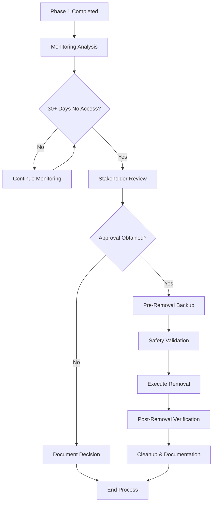

# Phase 2 Database Element Removal Process

**Document Version:** 1.0
**Issue:** #91 - Database Safety System
**Status:** Documentation Complete - Awaiting Implementation Approval

## Overview

This document outlines the comprehensive process for Phase 2 removal of deprecated database elements. Phase 2 is the final step in our database safety system, executing actual removal of elements that have been safely deprecated in Phase 1 and confirmed as truly unused through monitoring.

## Prerequisites

Before initiating Phase 2 removal:

1. **Phase 1 Deprecation Completed**: All elements must have completed Phase 1 deprecation
2. **Monitoring Period Passed**: Minimum 30-day monitoring period with no access detected
3. **Stakeholder Approval**: Required approvals obtained per environment requirements
4. **Backup Validation**: Recent, verified backups available
5. **Rollback Plan**: Emergency restoration procedures documented and tested

## Phase 2 Process Overview



## Environment-Specific Requirements

### Development Environment
- **Approval Required**: Tech Lead approval
- **Backup Required**: Optional but recommended
- **Monitoring Period**: 7 days minimum
- **Rollback Window**: 24 hours

### Staging Environment
- **Approval Required**: Tech Lead + Database Administrator
- **Backup Required**: Mandatory
- **Monitoring Period**: 14 days minimum
- **Rollback Window**: 48 hours

### Production Environment
- **Approval Required**: Database Administrator + Engineering Manager + Product Owner
- **Backup Required**: Mandatory with verification
- **Monitoring Period**: 30 days minimum
- **Rollback Window**: 72 hours
- **Additional Requirements**:
  - Change Advisory Board approval for high-risk removals
  - Maintenance window scheduling
  - Incident response team notification

## Approval Workflow

### 1. Monitoring Analysis Report

Generate comprehensive analysis of deprecated elements:

```bash
# Generate monitoring report
pnpm db:deprecation-cli status --detailed > monitoring-report.txt

# Analyze access patterns
pnpm db:deprecation-cli monitor --analysis-period 30
```

### 2. Stakeholder Review Process

**Required Documentation Package:**
- [ ] Monitoring analysis report
- [ ] Element usage analysis from Phase 1
- [ ] Impact assessment (performance, functionality, dependencies)
- [ ] Removal timeline and rollback plan
- [ ] Risk assessment matrix

**Approval Matrix:**

| Environment | Tech Lead | DBA | Eng Manager | Product Owner | CAB |
|-------------|-----------|-----|-------------|---------------|-----|
| Development | ✓ | - | - | - | - |
| Staging | ✓ | ✓ | - | - | - |
| Production | ✓ | ✓ | ✓ | ✓ | ✓* |

*Required for high-risk removals only

### 3. Approval Request Template

```markdown
# Phase 2 Removal Approval Request

**Request ID:** PHASE2-{YYYY}-{MM}-{DD}-{SEQ}
**Environment:** {env}
**Requestor:** {name}
**Date:** {date}

## Elements for Removal
- [ ] {element_type}: {original_name} (deprecated: {date})
- [ ] {element_type}: {original_name} (deprecated: {date})

## Monitoring Summary
- **Monitoring Period:** {days} days
- **Access Events:** {count}
- **Last Access:** {date_or_never}
- **Confidence Score:** {score}%

## Impact Assessment
- **Performance Impact:** {none/low/medium/high}
- **Functionality Impact:** {none/low/medium/high}
- **Risk Level:** {low/medium/high}

## Rollback Plan
- **Rollback Method:** Automated via deprecation metadata
- **Rollback Time:** < {minutes} minutes
- **Rollback Testing:** {completed/pending}

## Approval Required From
- [ ] Tech Lead: {name}
- [ ] Database Administrator: {name}
- [ ] Engineering Manager: {name} (production only)
- [ ] Product Owner: {name} (production only)

## Sign-off
**Tech Lead:** ________________ Date: ________
**DBA:** ________________ Date: ________
**Eng Manager:** ________________ Date: ________ (if required)
**Product Owner:** ________________ Date: ________ (if required)
```

## Phase 2 Implementation Steps

### Step 1: Pre-Removal Validation

Execute comprehensive safety checks before removal:

```sql
-- Validate removal candidates
SELECT * FROM get_removal_candidates(30); -- 30 days since last access

-- Final safety check
SELECT validate_phase2_readiness('element_name');

-- Verify backup status
SELECT verify_backup_current('pre_phase2');
```

### Step 2: Backup Creation

Create and validate backup before removal:

```bash
# Create pre-removal backup
pnpm db:deprecation-cli backup create --type "pre-phase2" --verify

# Validate backup integrity
pnpm db:deprecation-cli backup validate --backup-id {backup_id}
```

### Step 3: Execute Removal

**Manual Removal Process:**

```sql
-- Begin Phase 2 removal transaction
BEGIN;

-- Record removal intention
INSERT INTO phase2_removal_log (
    element_name, element_type, removal_timestamp,
    approved_by, backup_id, migration_id
) VALUES (...);

-- Execute actual removal
DROP TABLE {deprecated_table_name};

-- Update deprecation metadata
UPDATE deprecation_metadata
SET phase2_completed = true,
    removal_timestamp = NOW(),
    removal_method = 'DROP'
WHERE deprecated_name = '{deprecated_table_name}';

-- Verify removal
SELECT verify_removal_complete('{deprecated_table_name}');

COMMIT;
```

**Automated Removal via CLI:**

```bash
# Execute Phase 2 removal
pnpm db:deprecation-cli phase2 execute \
  --elements "table:juice_lots_deprecated_20250928_unu" \
  --approved-by "john.doe@company.com" \
  --backup-id "backup_pre_phase2_20250928" \
  --confirm

# Verify removal
pnpm db:deprecation-cli phase2 verify \
  --migration-id "phase2_removal_20250928"
```

### Step 4: Post-Removal Verification

Comprehensive verification after removal:

```sql
-- Verify elements are completely removed
SELECT verify_complete_removal();

-- Check for orphaned references
SELECT find_orphaned_references();

-- Validate system functionality
SELECT run_post_removal_tests();

-- Update system documentation
SELECT update_schema_documentation();
```

### Step 5: Cleanup and Documentation

Final cleanup and documentation update:

```sql
-- Clean up monitoring data for removed elements
SELECT cleanup_monitoring_data();

-- Archive deprecation metadata
UPDATE deprecation_metadata
SET archived = true
WHERE phase2_completed = true;

-- Generate removal report
SELECT generate_phase2_report();
```

## Rollback Procedures

### Emergency Rollback (Within Rollback Window)

If issues are discovered after Phase 2 removal:

```bash
# Emergency rollback from backup
pnpm db:deprecation-cli emergency-rollback \
  --backup-id "backup_pre_phase2_20250928" \
  --elements "table:juice_lots" \
  --reason "Critical dependency discovered"

# Validate rollback success
pnpm db:deprecation-cli validate-rollback \
  --original-element "juice_lots"
```

### Standard Rollback Process

For planned rollbacks:

1. **Assess Impact**: Determine scope of restoration needed
2. **Stakeholder Notification**: Inform relevant parties
3. **Execute Restoration**: Restore from pre-removal backup
4. **Validate Restoration**: Comprehensive testing
5. **Update Documentation**: Record rollback and lessons learned

## Monitoring and Alerting

### Post-Removal Monitoring

After Phase 2 completion, monitor for:

- Error rate increases
- Performance degradation
- Application errors related to removed elements
- Unexpected dependency discoveries

### Alerting Setup

```typescript
// Monitor for errors referencing removed elements
const postRemovalMonitoring = {
  errorPatterns: [
    /table.*does not exist/,
    /column.*does not exist/,
    /relation.*does not exist/
  ],
  alertThresholds: {
    errorCount: 5,
    timeWindow: '5m'
  },
  escalation: {
    immediate: ['dba-oncall@company.com'],
    after15min: ['engineering-manager@company.com']
  }
};
```

## Risk Management

### Risk Assessment Matrix

| Risk Level | Criteria | Mitigation |
|------------|----------|------------|
| **Low** | Non-table elements, no dependencies, >90 days deprecated | Standard process |
| **Medium** | Tables with <3 dependencies, >60 days deprecated | Extended monitoring, stakeholder review |
| **High** | Tables with >3 dependencies, <60 days deprecated | CAB approval, extended testing |
| **Critical** | Core tables, active dependencies | Manual review required |

### Mitigation Strategies

1. **Extended Monitoring**: Increase monitoring period for higher-risk elements
2. **Staged Rollout**: Remove elements in phases based on risk level
3. **Rollback Automation**: Automated rollback triggers for error spikes
4. **Dependency Scanning**: Enhanced dependency analysis before removal

## Quality Gates

### Pre-Removal Gates

- [ ] Monitoring period completed (minimum based on environment)
- [ ] Zero access events during monitoring window
- [ ] All required approvals obtained
- [ ] Backup created and validated
- [ ] Rollback plan tested
- [ ] Impact assessment completed

### Post-Removal Gates

- [ ] Removal executed successfully
- [ ] System functionality verified
- [ ] No error spikes detected
- [ ] Performance metrics stable
- [ ] Documentation updated

## Automation Support

### Phase 2 CLI Commands

```bash
# Check removal readiness
pnpm db:deprecation-cli phase2 check-readiness

# Generate approval request
pnpm db:deprecation-cli phase2 generate-approval-request \
  --elements "table:juice_lots_deprecated_20250928_unu" \
  --environment "production"

# Execute removal (after approval)
pnpm db:deprecation-cli phase2 execute \
  --approval-id "PHASE2-2025-09-28-001" \
  --confirm

# Monitor post-removal
pnpm db:deprecation-cli phase2 monitor \
  --duration "72h" \
  --alert-on-errors
```

### Integration with CI/CD

```yaml
# .github/workflows/phase2-removal.yml
name: Phase 2 Database Element Removal

on:
  workflow_dispatch:
    inputs:
      approval_id:
        description: 'Approval request ID'
        required: true
      environment:
        description: 'Target environment'
        required: true
        type: choice
        options: ['staging', 'production']

jobs:
  phase2-removal:
    runs-on: ubuntu-latest
    environment: ${{ inputs.environment }}

    steps:
      - name: Validate Approval
        run: |
          pnpm db:deprecation-cli phase2 validate-approval \
            --approval-id "${{ inputs.approval_id }}"

      - name: Create Backup
        run: |
          pnpm db:deprecation-cli backup create \
            --type "pre-phase2" \
            --verify

      - name: Execute Removal
        run: |
          pnpm db:deprecation-cli phase2 execute \
            --approval-id "${{ inputs.approval_id }}" \
            --confirm

      - name: Post-Removal Monitoring
        run: |
          pnpm db:deprecation-cli phase2 monitor \
            --duration "1h" \
            --alert-on-errors
```

## Documentation Requirements

### Required Documentation Updates

After Phase 2 completion:

1. **Schema Documentation**: Update database schema documentation
2. **API Documentation**: Update any affected API documentation
3. **Runbooks**: Update operational runbooks
4. **Disaster Recovery**: Update DR procedures
5. **Monitoring**: Update monitoring configurations

### Audit Trail

Maintain comprehensive audit trail:

```sql
-- Phase 2 audit log structure
CREATE TABLE phase2_audit_log (
    id UUID PRIMARY KEY DEFAULT gen_random_uuid(),
    element_name TEXT NOT NULL,
    element_type TEXT NOT NULL,
    action TEXT NOT NULL, -- 'approved', 'removed', 'rolled_back'
    timestamp TIMESTAMP WITH TIME ZONE DEFAULT NOW(),
    performed_by TEXT NOT NULL,
    approval_id TEXT,
    backup_id TEXT,
    rollback_id TEXT,
    metadata JSONB DEFAULT '{}'::jsonb
);
```

## Success Metrics

### Key Performance Indicators

- **Removal Success Rate**: % of removals completed without rollback
- **Rollback Rate**: % of removals requiring rollback
- **Time to Completion**: Average time from approval to completion
- **Post-Removal Stability**: Error rate change after removal

### Reporting

Monthly Phase 2 reporting should include:

- Number of elements removed
- Risk level distribution
- Rollback incidents and root causes
- Performance impact analysis
- Recommendations for process improvement

## Training Requirements

### Required Training for Team Members

1. **Database Administrators**:
   - Phase 2 removal procedures
   - Emergency rollback procedures
   - Backup validation processes

2. **Developers**:
   - Approval request process
   - CLI usage for Phase 2 operations
   - Post-removal monitoring

3. **Engineering Managers**:
   - Approval workflows
   - Risk assessment procedures
   - Escalation processes

### Training Materials

- Phase 2 process walkthrough documentation
- CLI command reference guide
- Emergency response procedures
- Risk assessment guidelines

## Conclusion

The Phase 2 removal process provides a safe, controlled method for permanently removing deprecated database elements. By following this comprehensive process, we ensure:

- Minimal risk of data loss or system disruption
- Comprehensive audit trail for compliance
- Automated rollback capabilities for emergency situations
- Stakeholder involvement and approval at appropriate levels

This process should be reviewed and updated quarterly based on operational experience and changing requirements.