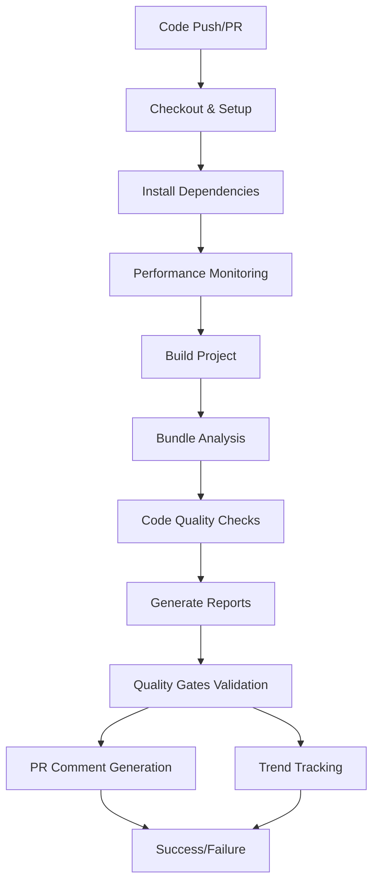

# CI Integration - Automated Cleanup Checks & Quality Gates

This document describes the automated cleanup checks and quality gates integration for the CideryManagementApp CI pipeline.

## Overview

The CI integration provides comprehensive code quality monitoring, performance benchmarking, and automated cleanup checks through GitHub Actions. It includes:

- **Performance Monitoring**: Build time, bundle size, and CI pipeline performance tracking
- **Code Quality Analysis**: Dead code detection, dependency analysis, and circular dependency checks
- **Bundle Analysis**: Detailed bundle size tracking with optimization recommendations
- **Quality Gates**: Configurable thresholds that prevent technical debt regression
- **PR Comments**: Automated reporting with actionable insights
- **Trend Tracking**: Historical performance and quality metrics

## Architecture

### Components

1. **GitHub Actions Workflow** (`.github/workflows/cleanup-checks.yml`)
2. **Analysis Scripts** (`.claude/scripts/ci/`)
3. **Quality Gates Configuration** (`.github/quality-gates.yml`)
4. **Reporting Infrastructure** (`analysis/reports/`)

### Workflow Structure



## Configuration

### Quality Gates Configuration

Edit `.github/quality-gates.yml` to customize thresholds:

```yaml
performance:
  max_build_time_seconds: 120
  max_total_ci_time_seconds: 600

bundle:
  max_total_size_kb: 1000
  max_gzipped_ratio: 0.4

code_quality:
  max_dead_code_files: 5
  max_unused_dependencies: 3
  max_circular_dependencies: 0
```

### Available Scripts

| Script | Purpose |
|--------|---------|
| `pnpm analysis:dead-code` | Find unused code with knip |
| `pnpm analysis:deps` | Check for unused dependencies |
| `pnpm analysis:circular` | Detect circular dependencies |
| `pnpm analysis:bundle` | Analyze bundle size and composition |
| `pnpm performance:monitor` | Track build and CI performance |
| `pnpm quality:validate` | Validate metrics against gates |
| `pnpm ci:test` | Test complete CI integration |

## Features

### 1. Performance Monitoring

Tracks key performance metrics:
- Build time
- Test execution time
- Total CI duration
- Cache hit rates
- Installation time

**Reports Generated:**
- `performance-metrics.json`: Raw performance data
- `performance-report.md`: Detailed performance analysis with recommendations

### 2. Bundle Analysis

Comprehensive bundle size tracking:
- Total bundle size (raw and gzipped)
- File-by-file breakdown
- Largest files identification
- Compression ratio analysis
- Size optimization recommendations

**Reports Generated:**
- `bundle-analysis.json`: Detailed bundle metrics
- `bundle-size.md`: Human-readable bundle report

### 3. Code Quality Checks

Automated code quality analysis:
- **Dead Code Detection**: Uses knip to find unused files and exports
- **Dependency Analysis**: Identifies unused dependencies with depcheck
- **Circular Dependencies**: Detects import cycles with madge
- **Asset Analysis**: Scans for unused assets
- **Database Analysis**: Checks for orphaned database queries

### 4. Quality Gates

Configurable thresholds that:
- Block PRs when quality degrades
- Provide early warning for performance regressions
- Suggest specific remediation actions
- Track trends over time

**Quality Gate Categories:**
- Performance (build time, CI duration)
- Bundle size (total size, compression ratio)
- Code quality (dead code, dependencies, circular deps)
- Test coverage (when implemented)
- Security vulnerabilities (future enhancement)

### 5. PR Comment Generation

Automated PR comments include:
- Performance overview with trends
- Bundle analysis summary
- Code quality metrics
- Quick action recommendations
- Links to detailed reports

**Example PR Comment:**
```markdown
## 🔍 Code Quality & Performance Analysis

### 🚀 Performance Overview
| Metric | Value | Threshold | Status | Trend |
|--------|-------|-----------|--------|-------|
| Build Time | 45s | 120s | ✅ Pass | ⚡ |
| Bundle Size | 850KB | 1000KB | ✅ Pass | 📦 |

### 🧹 Code Quality Metrics
| Metric | Count | Threshold | Status | Action Required |
|--------|-------|-----------|--------|-----------------|
| Dead Code Files | 2 | 5 | ✅ Pass | None |
| Unused Dependencies | 0 | 3 | ✅ Pass | None |

🎉 **All quality gates passed!** Your code is clean and performant.
```

### 6. Trend Tracking

Historical tracking of:
- Build performance trends
- Bundle size evolution
- Quality metric changes
- Baseline updates for improved metrics

**Trend Data Storage:**
- `analysis/reports/trends/performance-trends.json`
- `analysis/reports/trends/bundle-trends.json`
- `analysis/reports/baseline/` (current baseline metrics)

## Workflow Triggers

The CI workflow runs on:
- **Push** to main branches (`main`, `develop`, `epic/**`, `feature/**`)
- **Pull Requests** to main branches
- **Schedule** (daily at 6 AM UTC for trend tracking)

## Quality Gate Behavior

### Thresholds

| Metric | Default Threshold | Severity |
|--------|------------------|----------|
| Build Time | 120 seconds | Error |
| Total CI Time | 600 seconds | Error |
| Bundle Size | 1000 KB | Error |
| Dead Code Files | 5 | Error |
| Unused Dependencies | 3 | Error |
| Circular Dependencies | 0 | Error |

### Failure Actions

When quality gates fail:
1. **CI Pipeline Fails**: Prevents merge until issues are resolved
2. **PR Comment**: Details specific violations and remediation steps
3. **Notifications**: Team alerts (if configured)
4. **Issue Creation**: Automatic issue creation for violations (if enabled)

### Override Mechanisms

Quality gates can be overridden through:
- Configuration changes (requires approval)
- Emergency override flags (if enabled)
- Temporary threshold adjustments

## Reports and Artifacts

### Generated Reports

1. **CI Reports** (`analysis/reports/ci/`)
   - `bundle-analysis.json`: Bundle metrics
   - `performance-metrics.json`: Performance data
   - `quality-gates-report.md`: Validation results
   - `summary.md`: Overall analysis summary

2. **Trend Reports** (`analysis/reports/trends/`)
   - `performance-trends.json`: Historical performance
   - `bundle-trends.json`: Bundle size history

3. **Baseline Data** (`analysis/reports/baseline/`)
   - Current best metrics for comparison

### Artifact Retention

- **CI Reports**: 30 days
- **Trend Data**: 50 entries (rolling window)
- **Baseline Data**: Persistent (updated on improvement)

## Troubleshooting

### Common Issues

1. **Build Timeout**
   ```bash
   # Increase timeout in workflow
   timeout-minutes: 45
   ```

2. **Bundle Analysis Failure**
   ```bash
   # Ensure build completes successfully
   pnpm build
   pnpm analysis:bundle
   ```

3. **Quality Gate False Positives**
   ```bash
   # Check configuration
   pnpm quality:config

   # Validate specific metrics
   pnpm quality:validate path/to/metrics.json
   ```

### Testing Locally

Run the complete CI integration test:
```bash
pnpm ci:test
```

This validates:
- All scripts are properly configured
- Analysis tools work correctly
- Report generation functions
- Quality gates logic is sound

### Debug Mode

Enable verbose output:
```bash
# Set in quality-gates.yml
reporting:
  verbose_output: true
```

## Monitoring and Maintenance

### Performance Monitoring

Monitor CI performance through:
- GitHub Actions dashboard
- Performance trend reports
- Bundle size tracking

### Threshold Tuning

Adjust thresholds based on:
- Project growth and complexity
- Team productivity impact
- Historical performance data

### Regular Maintenance

1. **Weekly**: Review quality gate failures
2. **Monthly**: Analyze performance trends
3. **Quarterly**: Update thresholds and baselines

## Integration with Development Workflow

### Developer Experience

1. **Pre-commit**: Optional local quality checks
2. **PR Creation**: Automatic analysis and feedback
3. **Merge**: Quality gates prevent regression
4. **Post-merge**: Baseline updates and trend tracking

### Team Notifications

Configure notifications for:
- Quality gate failures
- Performance regressions
- Bundle size increases
- Security vulnerabilities

## Future Enhancements

### Planned Features

1. **Test Coverage Integration**: Coverage tracking and enforcement
2. **Security Scanning**: Vulnerability detection and reporting
3. **Performance Budgets**: Granular performance constraints
4. **Smart Baselines**: ML-driven baseline updates
5. **Integration Testing**: End-to-end test performance tracking

### Configuration Extensions

1. **Custom Rules**: Project-specific quality rules
2. **Team-specific Thresholds**: Different limits per team
3. **Environment-specific Gates**: Staging vs production thresholds
4. **Dynamic Thresholds**: Time-based or commit-based adjustments

## Conclusion

The CI integration provides comprehensive automated quality monitoring that:
- Prevents technical debt accumulation
- Ensures consistent performance
- Provides actionable feedback to developers
- Tracks long-term project health trends

The system is designed to be:
- **Non-intrusive**: Fast execution with intelligent caching
- **Actionable**: Specific recommendations for each violation
- **Configurable**: Adjustable thresholds and behavior
- **Comprehensive**: Covers all aspects of code quality and performance

For questions or issues, refer to the troubleshooting section or check the CI integration test results.