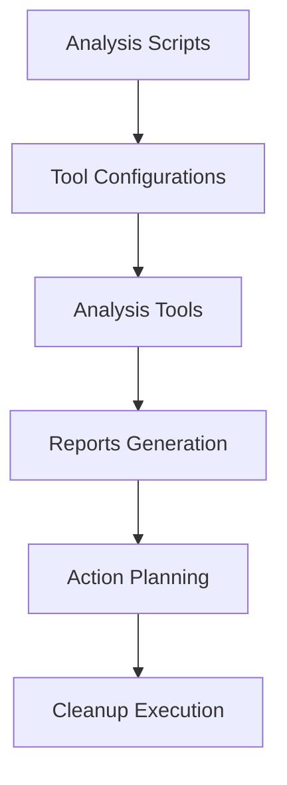

# Team Training Materials: Cleanup System

## Overview

This comprehensive training guide provides everything team members need to effectively use the cleanup system. It includes hands-on exercises, real-world scenarios, and progressive skill-building modules.

## Table of Contents

1. [Training Objectives](#training-objectives)
2. [Prerequisites](#prerequisites)
3. [Module 1: System Overview](#module-1-system-overview)
4. [Module 2: Basic Operations](#module-2-basic-operations)
5. [Module 3: Advanced Features](#module-3-advanced-features)
6. [Module 4: Safety and Recovery](#module-4-safety-and-recovery)
7. [Module 5: CI Integration](#module-5-ci-integration)
8. [Module 6: Database Operations](#module-6-database-operations)
9. [Hands-On Exercises](#hands-on-exercises)
10. [Certification Process](#certification-process)
11. [Reference Materials](#reference-materials)
12. [Troubleshooting Quick Reference](#troubleshooting-quick-reference)

## Training Objectives

By completing this training, team members will be able to:

### Knowledge Objectives
- Understand the cleanup system architecture and components
- Identify different types of technical debt and cleanup opportunities
- Recognize quality gate thresholds and their importance
- Understand safety procedures and rollback mechanisms

### Skill Objectives
- Execute basic cleanup operations safely
- Interpret analysis reports and take appropriate action
- Configure and customize analysis tools
- Perform emergency recovery procedures
- Integrate cleanup into development workflow

### Behavior Objectives
- Proactively identify cleanup opportunities
- Follow safety-first principles
- Communicate effectively during cleanup operations
- Contribute to continuous improvement of the system

## Prerequisites

### Technical Requirements
- Proficiency with command line interfaces
- Understanding of Node.js and pnpm package management
- Basic Git knowledge
- Familiarity with PostgreSQL databases
- Understanding of TypeScript and build systems

### Environment Setup
```bash
# Verify prerequisites
node --version    # Should be 18+
pnpm --version    # Should be 8+
git --version
psql --version

# Access to development environment
export DATABASE_URL="your-dev-database-url"
export NODE_ENV="development"

# Clone and setup training environment
git clone [repository-url]
cd cidery-management-app
pnpm install
pnpm build
pnpm test
```

### Access Requirements
- Development environment access
- Database connection permissions
- GitHub repository access
- CI/CD pipeline visibility

## Module 1: System Overview

### Learning Objectives
- Understand cleanup system architecture
- Learn about analysis tools and their purposes
- Understand the relationship between analysis and cleanup

### 1.1 Architecture Overview

The cleanup system consists of several integrated components:

#### Analysis Infrastructure


**Core Components:**
- **Analysis Scripts**: Located in `/analysis/scripts/`
- **Configuration Files**: Located in `/analysis/config/`
- **Reporting System**: Generates JSON and Markdown reports
- **Cleanup Executors**: Perform actual cleanup operations
- **Safety Systems**: Backup and rollback mechanisms

#### Tool Ecosystem
| Tool | Purpose | Output | Risk Level |
|------|---------|---------|------------|
| knip | Dead code detection | Unused exports list | Medium |
| ts-prune | TypeScript analysis | Unused declarations | Low |
| depcheck | Dependency analysis | Unused packages | Medium |
| madge | Circular dependencies | Dependency graph | Low |
| Custom scanners | Assets, DB, config | Targeted analysis | Varies |

### 1.2 Cleanup Categories

Understanding what each category addresses:

#### Code Cleanup
- **Dead Code**: Unreachable or unused code paths
- **Unused Exports**: Functions/classes exported but not used
- **Orphaned Files**: Files no longer referenced
- **Import Optimization**: Cleaning up import statements

#### Asset Cleanup
- **Duplicate Detection**: Identical or similar assets
- **Unused Assets**: Files not referenced in code
- **Size Optimization**: Compressing and optimizing assets

#### Dependency Cleanup
- **Unused Packages**: Dependencies not actually used
- **Version Optimization**: Resolving version conflicts
- **Security Updates**: Addressing vulnerable packages

#### Database Cleanup
- **Schema Analysis**: Unused tables and columns
- **Non-destructive Deprecation**: Phase 1 safety approach
- **Index Optimization**: Removing unused indexes

### 1.3 Quality Gates

Understanding the thresholds that protect code quality:

```yaml
# Quality Gate Thresholds
MAX_BUNDLE_SIZE_KB: 1000      # Bundle size limit
MAX_BUILD_TIME_SECONDS: 120   # Build time limit
MAX_DEAD_CODE_FILES: 5        # Dead code tolerance
MAX_UNUSED_DEPS: 3            # Unused dependency limit
MAX_CIRCULAR_DEPS: 0          # Circular dependency limit
MIN_TEST_COVERAGE: 80         # Test coverage requirement
```

**Exercise 1.1**: Analyze Current State
```bash
# Run comprehensive analysis
pnpm analysis:all

# Review reports
cat reports/consolidated-analysis-latest.md

# Identify quality gate violations
pnpm analysis:quality-gates
```

## Module 2: Basic Operations

### Learning Objectives
- Execute safe cleanup operations
- Understand dry-run vs. actual execution
- Learn to interpret analysis reports
- Practice backup and verification procedures

### 2.1 Safe Execution Principles

#### Always Use Dry-Run First
```bash
# WRONG: Direct execution
pnpm cleanup:code

# CORRECT: Dry-run first, then execute
pnpm cleanup:code --dry-run
# Review output, then:
pnpm cleanup:code --apply
```

#### Backup Before Major Operations
```bash
# Create comprehensive backup
pnpm cleanup:backup --comprehensive

# Verify backup
ls -la rollback-backup/
```

#### Incremental Approach
```bash
# Clean one category at a time
pnpm cleanup:assets --dry-run
pnpm cleanup:assets --apply
pnpm build && pnpm test  # Verify

pnpm cleanup:deps --dry-run
pnpm cleanup:deps --apply
pnpm build && pnpm test  # Verify again
```

### 2.2 Basic Workflow

#### Step 1: Pre-Cleanup Analysis
```bash
# Check current system state
git status  # Must be clean
pnpm build  # Must succeed
pnpm test   # Must pass

# Run comprehensive analysis
pnpm analysis:all

# Review findings
cat reports/consolidated-analysis-latest.md
```

#### Step 2: Create Backup
```bash
# Automated backup creation
pnpm cleanup:create-backup

# Manual backup if needed
git stash push -m "Pre-cleanup backup $(date)"
```

#### Step 3: Execute Cleanup
```bash
# Start with safest operations
pnpm cleanup:safe-only --dry-run
pnpm cleanup:safe-only --apply

# Verify after each step
pnpm build && pnpm test
```

#### Step 4: Validation
```bash
# Comprehensive validation
pnpm cleanup:validate-post-operation

# Performance verification
pnpm analysis:bundle --compare-baseline
```

### 2.3 Reading Analysis Reports

#### Understanding JSON Reports
```json
{
  "analysis": {
    "deadCode": {
      "files": ["src/unused-file.ts"],
      "exports": ["unusedFunction"],
      "severity": "medium"
    },
    "dependencies": {
      "unused": ["old-package"],
      "outdated": ["vulnerable-package"],
      "risk": "high"
    }
  }
}
```

#### Understanding Markdown Reports
The markdown reports provide human-readable summaries with recommended actions.

**Exercise 2.1**: Basic Cleanup Workflow
```bash
# 1. Analyze current state
pnpm analysis:all

# 2. Create backup
pnpm cleanup:create-backup

# 3. Execute safe cleanup
pnpm cleanup:safe-only --dry-run
# Review output, then:
pnpm cleanup:safe-only --apply

# 4. Verify results
pnpm build && pnpm test

# 5. Check improvements
pnpm analysis:bundle --compare-baseline
```

## Module 3: Advanced Features

### Learning Objectives
- Use advanced cleanup configurations
- Customize analysis tools
- Implement custom cleanup workflows
- Monitor performance impact

### 3.1 Advanced Configuration

#### Custom Analysis Configuration
```bash
# Customize knip configuration
cp analysis/config/knip.json analysis/config/knip.custom.json
# Edit custom configuration
pnpm analysis:dead-code --config custom
```

#### Selective Analysis
```bash
# Analyze specific packages only
pnpm analysis:deps --packages api,db

# Exclude certain areas
pnpm analysis:all --exclude tests,docs

# Focus on specific file patterns
pnpm analysis:code --include "src/**/*.ts"
```

### 3.2 Custom Workflows

#### Development Workflow Integration
```bash
# Pre-development cleanup
pnpm cleanup:prep-dev
# Equivalent to:
# - Quick analysis
# - Safe cleanups only
# - Performance baseline

# Post-development cleanup
pnpm cleanup:finalize-dev
# Equivalent to:
# - Comprehensive analysis
# - All safe cleanups
# - Quality gate validation
```

#### Release Preparation
```bash
# Comprehensive pre-release cleanup
pnpm cleanup:pre-release --validate-all
```

### 3.3 Performance Monitoring

#### Bundle Analysis
```bash
# Detailed bundle analysis
pnpm analysis:bundle --detailed --visualize

# Bundle size monitoring
pnpm monitor:bundle --continuous
```

#### Build Performance
```bash
# Build time profiling
pnpm build --profile --analyze

# TypeScript performance
pnpm typecheck --extendedDiagnostics
```

**Exercise 3.1**: Advanced Cleanup Configuration
```bash
# 1. Customize analysis for your area
cp analysis/config/knip.json analysis/config/knip-frontend.json
# Edit to focus on frontend files only

# 2. Run custom analysis
pnpm analysis:dead-code --config frontend

# 3. Create custom cleanup script
echo 'pnpm cleanup:code --safe-only && pnpm cleanup:assets' > my-cleanup.sh
chmod +x my-cleanup.sh
./my-cleanup.sh
```

## Module 4: Safety and Recovery

### Learning Objectives
- Understand backup and recovery mechanisms
- Practice emergency rollback procedures
- Learn to identify and respond to issues
- Implement safety-first practices

### 4.1 Backup Strategies

#### Automated Backup Creation
```bash
# Comprehensive backup
pnpm cleanup:backup --full
# Creates:
# - Git stash of all changes
# - Package.json backups
# - Database backup
# - Build artifacts backup
```

#### Manual Backup for Critical Operations
```bash
# Before major dependency changes
cp package.json package.json.backup
cp pnpm-lock.yaml pnpm-lock.yaml.backup

# Before database operations
pg_dump $DATABASE_URL > db_backup_$(date +%Y%m%d_%H%M%S).sql
```

### 4.2 Recovery Procedures

#### Quick Recovery (Build Failures)
```bash
# Immediate rollback
git reset --hard HEAD~1
pnpm install

# Verify recovery
pnpm build && pnpm test
```

#### Selective Recovery
```bash
# Restore specific files
git checkout HEAD~1 -- package.json
git checkout HEAD~1 -- pnpm-lock.yaml
pnpm install
```

#### Database Recovery
```bash
# Restore from backup
psql $DATABASE_URL < db_backup_20240928_143000.sql

# Verify database integrity
pnpm db:test
```

### 4.3 Issue Detection

#### Early Warning Signs
- Build time increases significantly
- Test failures after cleanup
- Runtime errors in development
- Unusual bundle size changes

#### Monitoring Commands
```bash
# Continuous monitoring during cleanup
pnpm monitor:health --during-cleanup

# Performance regression detection
pnpm monitor:performance --alert-on-regression
```

**Exercise 4.1**: Recovery Practice
```bash
# 1. Create intentional issue
echo "export const broken = 'test';" >> src/components/broken.ts
pnpm build  # Should fail

# 2. Practice recovery
git status
git checkout -- src/components/broken.ts
pnpm build  # Should succeed

# 3. Practice backup/restore
pnpm cleanup:backup --full
# Make some changes
pnpm cleanup:restore --from-latest
```

## Module 5: CI Integration

### Learning Objectives
- Understand CI/CD integration
- Interpret CI feedback and reports
- Respond to quality gate failures
- Configure CI behavior

### 5.1 CI Workflow Understanding

#### Trigger Conditions
- **Push to main/develop/epic branches**: Full analysis
- **Pull request creation**: Comprehensive review with comments
- **Daily scheduled runs**: Maintenance and monitoring
- **Manual dispatch**: On-demand analysis

#### Quality Gate Evaluation
```yaml
# CI checks these thresholds
if bundle_size > MAX_BUNDLE_SIZE_KB:
  fail("Bundle too large")
if build_time > MAX_BUILD_TIME_SECONDS:
  fail("Build too slow")
if dead_code_files > MAX_DEAD_CODE_FILES:
  fail("Too much dead code")
```

### 5.2 PR Comment Integration

#### Understanding Automated Comments
PR comments include:
- **Analysis Summary**: What was found
- **Performance Impact**: How changes affect performance
- **Quality Gate Status**: Pass/fail with specific details
- **Recommended Actions**: What to do next

#### Responding to PR Comments
```bash
# Address quality gate failures locally
pnpm analysis:quality-gates --fix-violations

# Re-run analysis to verify fixes
pnpm analysis:all --validate-quality-gates
```

### 5.3 Local CI Simulation

#### Test CI Behavior Locally
```bash
# Simulate CI environment
export CI=true
export MAX_BUNDLE_SIZE_KB=1000

# Run CI-style analysis
pnpm cleanup:ci-simulation

# Generate CI-style reports
pnpm reports:ci-format
```

**Exercise 5.1**: CI Integration Practice
```bash
# 1. Create a branch with changes
git checkout -b training/ci-practice

# 2. Make changes that violate quality gates
# (Add unnecessary dependencies)
pnpm add lodash moment

# 3. Test CI locally
pnpm cleanup:ci-simulation

# 4. Fix quality gate violations
pnpm cleanup:deps --remove-unused

# 5. Verify CI passes
pnpm cleanup:ci-simulation --expect-pass
```

## Module 6: Database Operations

### Learning Objectives
- Understand database safety systems
- Execute Phase 1 deprecation operations
- Monitor database cleanup impact
- Implement safe database practices

### 6.1 Database Safety System

#### Two-Phase Approach
**Phase 1: Non-Destructive Deprecation**
- Mark elements with `_deprecated_YYYYMMDD` suffix
- Preserve all functionality
- Full rollback capability

**Phase 2: Destructive Removal** (Manual approval required)
- Actual removal of deprecated elements
- Requires explicit approval
- Complete backup and validation

### 6.2 Phase 1 Operations

#### Database Analysis
```bash
# Comprehensive database analysis
pnpm db:analyze --comprehensive

# Review findings
cat reports/database-analysis.md
```

#### Deprecation Execution
```bash
# Preview deprecation operations
pnpm db:deprecate --phase1 --dry-run

# Apply deprecation migrations
pnpm db:deprecate --phase1 --apply

# Validate deprecation impact
pnpm db:validate-deprecations
```

### 6.3 Migration Management

#### Tracking Changes
```bash
# Check migration status
pnpm db:migration-status

# View deprecation history
pnpm db:deprecation-history
```

#### Rollback Procedures
```bash
# Rollback specific deprecation
pnpm db:rollback-deprecation --migration-id 20240928

# Full deprecation rollback
pnpm db:rollback-all-deprecations
```

**Exercise 6.1**: Database Deprecation Practice
```bash
# 1. Analyze database for cleanup opportunities
pnpm db:analyze --comprehensive

# 2. Review deprecation candidates
cat reports/database-analysis.md

# 3. Apply deprecation in dry-run mode
pnpm db:deprecate --phase1 --dry-run

# 4. If safe, apply deprecation
pnpm db:deprecate --phase1 --apply

# 5. Validate application still works
pnpm build && pnpm test

# 6. Monitor for any issues
pnpm db:monitor-deprecation-impact
```

## Hands-On Exercises

### Exercise Set A: Beginner Level

#### A1: First Cleanup
**Objective**: Complete your first safe cleanup operation

**Steps**:
1. Run comprehensive analysis
2. Create backup
3. Execute safe-only cleanup
4. Verify results

**Success Criteria**:
- No build failures
- All tests pass
- Some improvement in metrics

#### A2: Report Interpretation
**Objective**: Learn to read and act on analysis reports

**Steps**:
1. Generate analysis reports
2. Identify top 3 issues
3. Plan cleanup approach
4. Execute selective cleanup

**Success Criteria**:
- Correctly identify issues
- Choose appropriate cleanup strategy
- Successfully resolve issues

### Exercise Set B: Intermediate Level

#### B1: Custom Configuration
**Objective**: Customize analysis tools for your needs

**Steps**:
1. Copy and modify tool configurations
2. Run analysis with custom config
3. Compare results with default
4. Document improvements

**Success Criteria**:
- Custom configuration works
- Results show improvement
- Changes are documented

#### B2: CI Integration
**Objective**: Understand and work with CI integration

**Steps**:
1. Create PR with quality gate violations
2. Review CI feedback
3. Fix violations locally
4. Verify CI passes

**Success Criteria**:
- Understand CI feedback
- Successfully fix violations
- CI pipeline passes

### Exercise Set C: Advanced Level

#### C1: Emergency Recovery
**Objective**: Practice emergency recovery procedures

**Steps**:
1. Simulate cleanup failure
2. Assess damage
3. Execute recovery procedure
4. Verify full restoration

**Success Criteria**:
- Quick damage assessment
- Successful recovery
- No data loss

#### C2: Performance Optimization
**Objective**: Use cleanup system for performance improvements

**Steps**:
1. Establish performance baseline
2. Identify optimization opportunities
3. Execute targeted cleanup
4. Measure improvements

**Success Criteria**:
- Measurable performance gains
- No functionality loss
- Sustainable improvements

## Certification Process

### Knowledge Assessment

#### Written Exam (30 questions)
- System architecture understanding
- Tool capabilities and limitations
- Safety procedures
- Quality gate concepts
- Recovery procedures

#### Practical Assessment
1. **Basic Operations** (Pass/Fail)
   - Execute safe cleanup workflow
   - Interpret analysis reports
   - Create and restore backups

2. **Advanced Operations** (Scored)
   - Custom configuration
   - Performance optimization
   - CI integration

3. **Emergency Response** (Pass/Fail)
   - Issue identification
   - Recovery execution
   - Post-incident documentation

### Certification Levels

#### Level 1: Basic User
**Requirements**:
- Complete Modules 1-2
- Pass written exam (70%)
- Complete Exercise Set A

**Capabilities**:
- Execute safe cleanup operations
- Basic report interpretation
- Standard backup/recovery

#### Level 2: Advanced User
**Requirements**:
- Complete Modules 1-4
- Pass written exam (80%)
- Complete Exercise Sets A-B

**Capabilities**:
- Custom configurations
- Advanced troubleshooting
- CI integration management

#### Level 3: Expert User
**Requirements**:
- Complete all modules
- Pass written exam (90%)
- Complete all exercise sets
- Demonstrate emergency response

**Capabilities**:
- System administration
- Emergency response leadership
- Training delivery

### Recertification

**Annual Requirements**:
- Complete refresher training
- Pass updated assessment
- Demonstrate continued competency

## Reference Materials

### Quick Command Reference

```bash
# Analysis
pnpm analysis:all                    # Comprehensive analysis
pnpm analysis:dead-code              # Dead code detection
pnpm analysis:deps                   # Dependency analysis
pnpm analysis:assets                 # Asset analysis
pnpm analysis:database               # Database analysis

# Cleanup
pnpm cleanup:safe-only               # Safe cleanups only
pnpm cleanup:code --dry-run          # Preview code cleanup
pnpm cleanup:deps --apply            # Apply dependency cleanup
pnpm cleanup:assets                  # Asset cleanup

# Safety
pnpm cleanup:backup --full           # Create comprehensive backup
pnpm cleanup:restore --from-latest   # Restore from backup
pnpm cleanup:validate                # Validate system state

# CI/Database
pnpm cleanup:ci-simulation           # Simulate CI locally
pnpm db:deprecate --phase1           # Database deprecation
pnpm db:rollback-deprecation         # Rollback database changes
```

### Configuration Files Reference

| File | Purpose | Location |
|------|---------|----------|
| `knip.json` | Dead code analysis | `/analysis/config/` |
| `depcheck.config.js` | Dependency analysis | `/analysis/config/` |
| `cleanup-analysis.yml` | CI workflow | `/.github/workflows/` |
| `package.json` | Scripts and dependencies | Root and packages |

### Useful Aliases

```bash
# Add to your shell profile
alias ca='pnpm analysis:all'
alias cdr='pnpm cleanup:code --dry-run'
alias cda='pnpm cleanup:code --apply'
alias cb='pnpm cleanup:backup --full'
alias cv='pnpm cleanup:validate'
```

## Troubleshooting Quick Reference

### Common Issues and Solutions

| Issue | Quick Fix | Full Solution |
|-------|-----------|---------------|
| Build fails after cleanup | `git reset --hard HEAD~1` | Check [troubleshooting.md](./troubleshooting.md) |
| Tests fail | `pnpm install && pnpm test` | Restore test dependencies |
| Bundle size increases | `pnpm analysis:bundle` | Check for added dependencies |
| CI quality gates fail | `pnpm cleanup:fix-quality-issues` | Review and fix violations |

### Emergency Contacts

- **Training Issues**: [Training Coordinator]
- **Technical Issues**: [Development Team Lead]
- **System Issues**: [System Administrator]
- **Emergency**: [On-Call Engineer]

### Additional Resources

- [Operation Guide](./operation-guide.md): Detailed operational procedures
- [Troubleshooting Guide](./troubleshooting.md): Comprehensive issue resolution
- [Rollback Procedures](./rollback-procedures.md): Recovery procedures
- [Tool Configuration](./tool-configuration.md): Advanced configuration options

---

**Training Completion**: Upon completing this training, you'll be equipped to safely and effectively use the cleanup system to maintain code quality and reduce technical debt. Remember: safety first, incremental changes, and always verify your work.